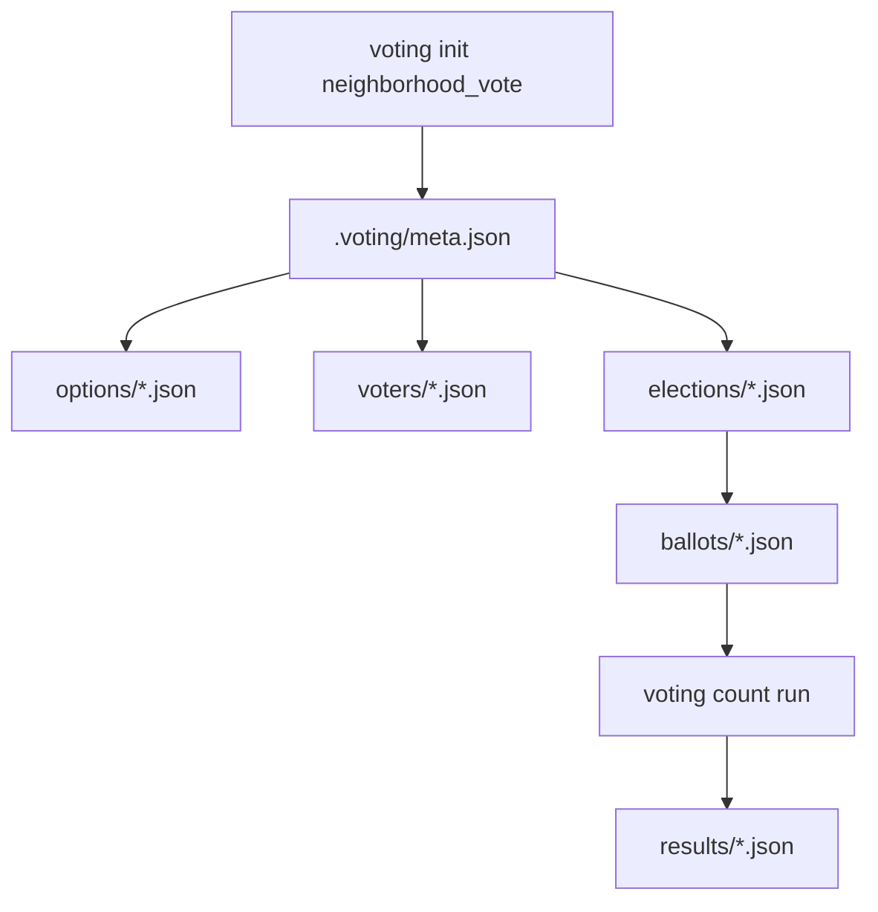
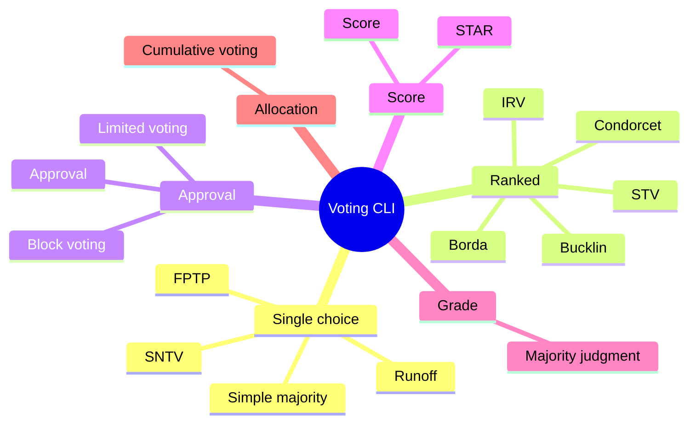
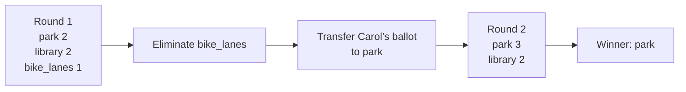
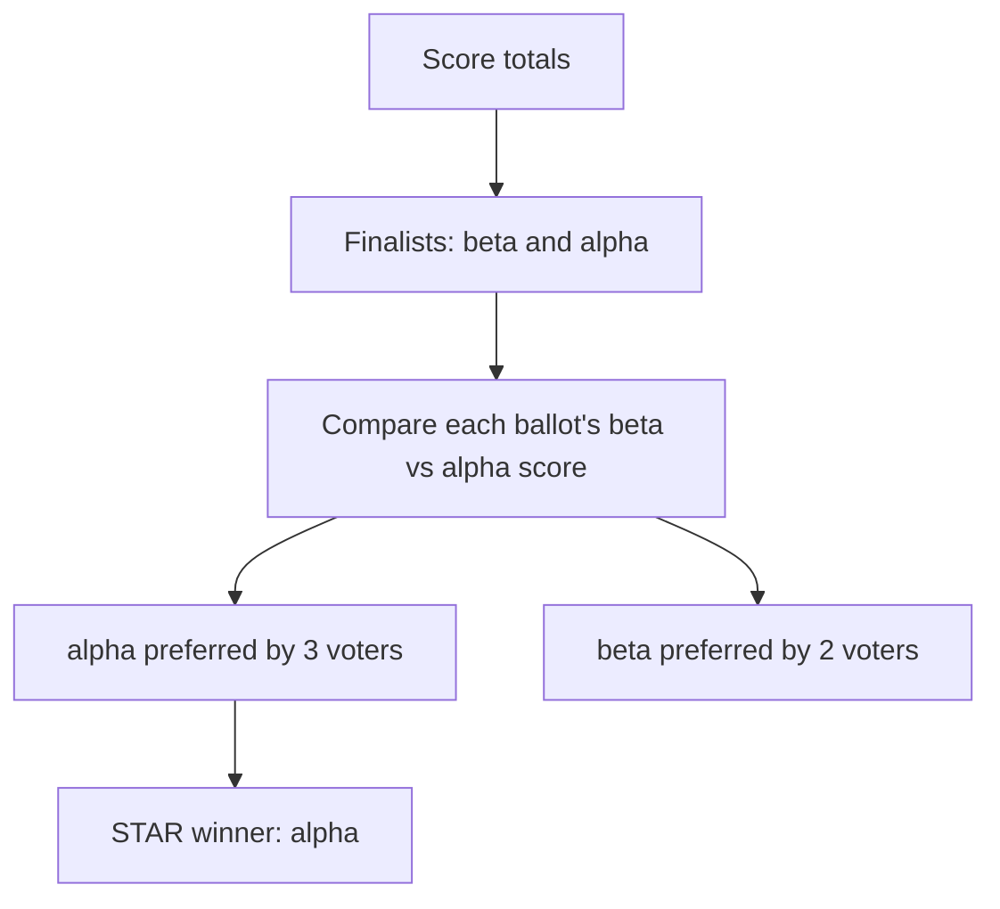
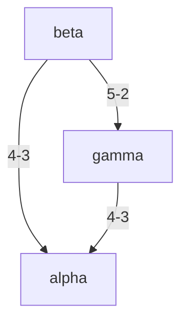
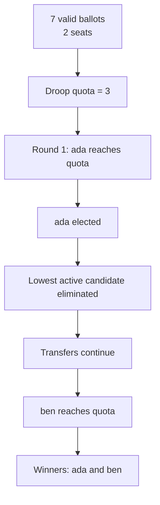

# Voting CLI

`voting` is a JSON-first Python CLI for building voting scenarios, recording ballots, and
comparing election methods against the same underlying data.

It is designed for experimentation: create a small project, register options and voters,
cast ballots, then run several counting rules to see how the outcome changes.

The implementation follows the structure of `/Users/jjhorton/tools/mcda`: a Typer CLI,
project-local `.voting/` storage, small JSON files, structured JSON output, structured
errors, and scenario tests.

## What It Supports

Single-winner methods:

- First past the post
- Simple majority
- Borda count
- Instant runoff voting
- Approval voting
- Score/range voting
- STAR voting
- Two-round runoff
- Bucklin voting
- Majority judgment

Multi-winner methods:

- Single transferable vote
- Block voting
- Limited voting
- Single non-transferable vote
- Cumulative voting

Condorcet methods:

- Copeland
- Minimax
- Ranked Pairs / Tideman
- Schulze / beatpath
- Kemeny-Young

## Install

From this repository:

```bash
pip install -e .
```

You can also run the CLI without installing the entrypoint:

```bash
python -m voting.cli --help
```

After installation:

```bash
voting --help
```

## Core Model

The tool stores each voting project in a normal directory with a hidden `.voting/`
subdirectory. Commands find the project by walking upward from the current working
directory, or by using `--project <path>`.



Example project layout:

```text
neighborhood_vote/
  .voting/
    meta.json
    elections/
    options/
    voters/
    ballots/
    policies/
    sessions/
    results/
    reports/
```

Commands return JSON by default:

```json
{
  "data": {},
  "warnings": []
}
```

Errors are JSON too:

```json
{
  "error": {
    "code": "user_error",
    "message": "Election has no eligible options.",
    "details": {
      "election_id": "neighborhood_projects"
    }
  }
}
```

Use `--human` for concise human-readable output:

```bash
voting --human info
```

## Concepts

### Options

Options are the things that can win: candidates, proposals, projects, vendors, sites, or
other alternatives.

```bash
voting option add park "Pocket Park"
voting option add library "Library Hours"
voting option add bike_lanes "Bike Lanes"
```

### Voters

Voters are registered participants. Each voter has a default weight of `1.0`, which makes
weighted and synthetic voting scenarios possible.

```bash
voting voter add alice "Alice Rivera"
voting voter add bob "Bob Chen"
voting voter add carol "Carol Singh"
```

### Elections

An election defines the counting context: method, ballot type, number of seats, options,
and tie policy.

```bash
voting election add neighborhood_projects "Neighborhood Projects" \
  --method irv \
  --ballot-type ranked \
  --seats 1

voting election add-option neighborhood_projects park
voting election add-option neighborhood_projects library
voting election add-option neighborhood_projects bike_lanes
voting election open neighborhood_projects
```

### Ballots

Ballots are append-only records. If the same voter casts again in the same election, the
latest valid ballot supersedes earlier ballots for counting, but the earlier records stay
on disk.

Supported ballot commands:

```bash
voting ballot cast <election_id> <voter_id> --choice <option_id>
voting ballot rank <election_id> <voter_id> <option_id>...
voting ballot approve <election_id> <voter_id> --option <option_id> [--option <option_id> ...]
voting ballot score <election_id> <voter_id> <option_id>=<score>...
voting ballot grade <election_id> <voter_id> <option_id>=<grade>...
voting ballot allocate <election_id> <voter_id> <option_id>=<votes>...
```

### Counting

Run the election's default method:

```bash
voting count run neighborhood_projects
```

Run a specific method against the same ballots:

```bash
voting count run neighborhood_projects --method borda
voting count run neighborhood_projects --method irv
voting count run neighborhood_projects --method stv
```

Every count writes a result snapshot under `.voting/results/`.

## Method Families



## Worked Example 1: Ranked Neighborhood Project

This example shows how the same ranked ballots can produce different winners under FPTP,
Borda, IRV, and STV.

```bash
voting init neighborhood_vote --description "Choose one neighborhood funding project."
cd neighborhood_vote

voting option add park "Pocket Park"
voting option add library "Library Hours"
voting option add bike_lanes "Bike Lanes"

voting voter add alice "Alice Rivera"
voting voter add bob "Bob Chen"
voting voter add carol "Carol Singh"
voting voter add dana "Dana Patel"
voting voter add eli "Eli Morgan"

voting election add neighborhood_projects "Neighborhood Projects" \
  --method stv \
  --ballot-type ranked \
  --seats 1

voting election add-option neighborhood_projects park
voting election add-option neighborhood_projects library
voting election add-option neighborhood_projects bike_lanes
voting election open neighborhood_projects

voting ballot rank neighborhood_projects alice park library bike_lanes
voting ballot rank neighborhood_projects bob library park bike_lanes
voting ballot rank neighborhood_projects carol bike_lanes park library
voting ballot rank neighborhood_projects dana park bike_lanes library
voting ballot rank neighborhood_projects eli library bike_lanes park
```

First-choice totals:

| Option | Votes |
| --- | ---: |
| `park` | 2 |
| `library` | 2 |
| `bike_lanes` | 1 |

Run several methods:

```bash
voting count run neighborhood_projects --method fptp
voting count run neighborhood_projects --method borda
voting count run neighborhood_projects --method irv
voting count run neighborhood_projects --method stv
```

Expected winners:

| Method | Winner | Why |
| --- | --- | --- |
| `fptp` | `library` | `park` and `library` tie on first choices; lexicographic tie policy selects `library`. |
| `borda` | `park` | Ranked points are `park=6`, `library=5`, `bike_lanes=4`. |
| `irv` | `park` | `bike_lanes` is eliminated and transfers to `park`. |
| `stv` | `park` | One-seat STV matches IRV behavior. |

IRV flow:



## Worked Example 2: Majority Referendum

Use `simple_majority` when winning should require more than half of valid non-abstaining
ballot weight.

```bash
voting init pool_vote
cd pool_vote

voting option add yes "Build Pool"
voting option add no "Do Not Build Pool"

voting voter add alice "Alice"
voting voter add bob "Bob"
voting voter add carol "Carol"
voting voter add dana "Dana"
voting voter add eli "Eli"

voting election add community_pool_referendum "Community Pool Referendum" \
  --method simple_majority \
  --ballot-type single_choice

voting election add-option community_pool_referendum yes
voting election add-option community_pool_referendum no
voting election open community_pool_referendum

voting ballot cast community_pool_referendum alice --choice yes
voting ballot cast community_pool_referendum bob --choice yes
voting ballot cast community_pool_referendum carol --choice yes
voting ballot cast community_pool_referendum dana --choice no
voting ballot cast community_pool_referendum eli --choice no

voting count run community_pool_referendum --method simple_majority
```

Expected result: `yes` wins with 3 of 5 votes.

## Worked Example 3: Approval And Block Voting

Approval ballots let voters support every option they find acceptable.

```bash
voting init festival_vote
cd festival_vote

voting option add music "Music Stage"
voting option add food "Food Market"
voting option add art "Art Walk"
voting option add sports "Sports Court"

voting voter add alice "Alice"
voting voter add bob "Bob"
voting voter add carol "Carol"
voting voter add dana "Dana"
voting voter add eli "Eli"

voting election add festival_committee "Festival Committee" \
  --method approval \
  --ballot-type approval \
  --seats 2

voting election add-option festival_committee music
voting election add-option festival_committee food
voting election add-option festival_committee art
voting election add-option festival_committee sports
voting election open festival_committee

voting ballot approve festival_committee alice --option music --option food
voting ballot approve festival_committee bob --option music --option art
voting ballot approve festival_committee carol --option food --option art
voting ballot approve festival_committee dana --option music --option sports
voting ballot approve festival_committee eli --option art --option sports

voting count run festival_committee --method approval
voting count run festival_committee --method block_voting
```

Expected totals:

| Option | Approvals |
| --- | ---: |
| `music` | 3 |
| `art` | 3 |
| `food` | 2 |
| `sports` | 2 |

Expected winners: `art` and `music`.

## Worked Example 4: Score Voting And STAR

Score voting picks the option with the highest total score. STAR voting uses scores to
select two finalists, then runs an automatic runoff between them.

```bash
voting init vendor_vote
cd vendor_vote

voting option add alpha "Alpha"
voting option add beta "Beta"
voting option add gamma "Gamma"

voting voter add alice "Alice"
voting voter add bob "Bob"
voting voter add carol "Carol"
voting voter add dana "Dana"
voting voter add eli "Eli"

voting election add software_vendor "Software Vendor" \
  --method star \
  --ballot-type score

voting election add-option software_vendor alpha
voting election add-option software_vendor beta
voting election add-option software_vendor gamma
voting election open software_vendor

voting ballot score software_vendor alice alpha=5 beta=4 gamma=0
voting ballot score software_vendor bob alpha=5 beta=3 gamma=0
voting ballot score software_vendor carol alpha=0 beta=5 gamma=4
voting ballot score software_vendor dana alpha=0 beta=5 gamma=3
voting ballot score software_vendor eli alpha=3 beta=2 gamma=5

voting count run software_vendor --method score
voting count run software_vendor --method star
```

Score totals:

| Option | Score |
| --- | ---: |
| `beta` | 19 |
| `alpha` | 13 |
| `gamma` | 12 |

STAR runoff:



The score winner is `beta`; the STAR winner is `alpha`.

## Worked Example 5: Condorcet Methods

Condorcet methods compare every pair of options head-to-head.

```bash
voting init policy_vote
cd policy_vote

voting option add alpha "Alpha"
voting option add beta "Beta"
voting option add gamma "Gamma"

voting voter add v1 "V1"
voting voter add v2 "V2"
voting voter add v3 "V3"
voting voter add v4 "V4"
voting voter add v5 "V5"
voting voter add v6 "V6"
voting voter add v7 "V7"

voting election add policy_package "Policy Package" \
  --method condorcet_copeland \
  --ballot-type ranked

voting election add-option policy_package alpha
voting election add-option policy_package beta
voting election add-option policy_package gamma
voting election open policy_package

voting ballot rank policy_package v1 alpha beta gamma
voting ballot rank policy_package v2 alpha beta gamma
voting ballot rank policy_package v3 alpha beta gamma
voting ballot rank policy_package v4 beta gamma alpha
voting ballot rank policy_package v5 beta gamma alpha
voting ballot rank policy_package v6 gamma beta alpha
voting ballot rank policy_package v7 gamma beta alpha

voting count run policy_package --method condorcet_copeland
voting count run policy_package --method condorcet_minimax
```

Pairwise results:

| Pair | Winner | Margin |
| --- | --- | ---: |
| `beta` vs `alpha` | `beta` | 4 to 3 |
| `beta` vs `gamma` | `beta` | 5 to 2 |
| `gamma` vs `alpha` | `gamma` | 4 to 3 |

`beta` is the Condorcet winner because it beats every other option head-to-head.



## Worked Example 6: Multi-Seat STV

Single transferable vote elects multiple winners using ranked ballots, a quota, surplus
transfers, and eliminations.

```bash
voting init council_vote
cd council_vote

voting option add ada "Ada"
voting option add ben "Ben"
voting option add cy "Cy"
voting option add dia "Dia"

voting voter add v1 "V1"
voting voter add v2 "V2"
voting voter add v3 "V3"
voting voter add v4 "V4"
voting voter add v5 "V5"
voting voter add v6 "V6"
voting voter add v7 "V7"

voting election add council_stv "Council STV" \
  --method stv \
  --ballot-type ranked \
  --seats 2

voting election add-option council_stv ada
voting election add-option council_stv ben
voting election add-option council_stv cy
voting election add-option council_stv dia
voting election open council_stv

voting ballot rank council_stv v1 ada ben cy dia
voting ballot rank council_stv v2 ada ben cy dia
voting ballot rank council_stv v3 ada ben cy dia
voting ballot rank council_stv v4 ben ada cy dia
voting ballot rank council_stv v5 ben ada cy dia
voting ballot rank council_stv v6 cy ben ada dia
voting ballot rank council_stv v7 dia cy ben ada

voting count run council_stv --method stv
```

Expected behavior:

| Item | Value |
| --- | --- |
| Seats | 2 |
| Droop quota | 3 |
| First elected | `ada` |
| Final winners | `ada`, `ben` |

STV process:



## Worked Example 7: Cumulative Voting

Cumulative voting gives each voter a vote budget they can distribute across options.

```bash
voting init budget_vote
cd budget_vote

voting option add lighting "Lighting"
voting option add trees "Trees"
voting option add sidewalks "Sidewalks"
voting option add murals "Murals"

voting voter add alice "Alice"
voting voter add bob "Bob"
voting voter add carol "Carol"
voting voter add dana "Dana"
voting voter add eli "Eli"

voting election add capital_budget "Capital Budget" \
  --method cumulative \
  --ballot-type allocated \
  --seats 2

voting election add-option capital_budget lighting
voting election add-option capital_budget trees
voting election add-option capital_budget sidewalks
voting election add-option capital_budget murals
voting election open capital_budget

voting ballot allocate capital_budget alice lighting=5
voting ballot allocate capital_budget bob lighting=3 trees=2
voting ballot allocate capital_budget carol trees=5
voting ballot allocate capital_budget dana sidewalks=5
voting ballot allocate capital_budget eli sidewalks=3 murals=2

voting count run capital_budget --method cumulative
```

Expected winners: `lighting` and `sidewalks`.

## Worked Example 8: Majority Judgment

Majority judgment uses grades instead of ranks or scores. The primary statistic is the
median grade.

```bash
voting init grade_vote
cd grade_vote

voting option add park "Park"
voting option add library "Library"
voting option add transit "Transit"

voting voter add alice "Alice"
voting voter add bob "Bob"
voting voter add carol "Carol"
voting voter add dana "Dana"
voting voter add eli "Eli"

voting election add site_selection_grade "Site Selection" \
  --method majority_judgment \
  --ballot-type grade

voting election add-option site_selection_grade park
voting election add-option site_selection_grade library
voting election add-option site_selection_grade transit
voting election open site_selection_grade

voting ballot grade site_selection_grade alice park=excellent library=good transit=excellent
voting ballot grade site_selection_grade bob park=good library=good transit=fair
voting ballot grade site_selection_grade carol park=good library=fair transit=fair
voting ballot grade site_selection_grade dana park=fair library=fair transit=poor
voting ballot grade site_selection_grade eli park=fair library=poor transit=reject

voting count run site_selection_grade --method majority_judgment
```

Expected medians:

| Option | Median |
| --- | --- |
| `park` | good |
| `library` | fair |
| `transit` | fair |

Expected winner: `park`.

## Command Reference

### Project

```bash
voting init <name> [--description TEXT]
voting info
```

### Options

```bash
voting option add <option_id> <name> [--type candidate] [--description TEXT]
voting option list [--type all]
voting option show <option_id>
voting option set-eligible <option_id> <true|false>
```

### Voters

```bash
voting voter add <voter_id> <name> [--weight FLOAT]
voting voter list
voting voter show <voter_id>
voting voter set-trait <voter_id> <key> <json_value>
voting voter set-eligible <voter_id> <true|false>
```

### Elections

```bash
voting election add <election_id> <name> \
  [--method METHOD] \
  [--ballot-type TYPE] \
  [--seats N] \
  [--tie-policy POLICY] \
  [--description TEXT]

voting election list
voting election show <election_id>
voting election open <election_id>
voting election close <election_id>
voting election set-method <election_id> <method>
voting election add-option <election_id> <option_id>
voting election remove-option <election_id> <option_id>
```

### Ballots

```bash
voting ballot cast <election_id> <voter_id> --choice <option_id>
voting ballot rank <election_id> <voter_id> <option_id>...
voting ballot approve <election_id> <voter_id> --option <option_id> [--option <option_id> ...]
voting ballot score <election_id> <voter_id> <option_id>=<score>...
voting ballot grade <election_id> <voter_id> <option_id>=<grade>...
voting ballot allocate <election_id> <voter_id> <option_id>=<votes>...
voting ballot list [--election <election_id>] [--voter <voter_id>]
voting ballot show <ballot_record_id>
voting ballot validate <election_id>
```

### Counting

```bash
voting count run <election_id> [--method METHOD] [--seats N] [--tie-policy POLICY]
voting count list [--election <election_id>]
voting count show <result_id>
```

Supported method names and aliases:

```text
fptp
first_past_the_post
simple_majority
borda
irv
stv
single_transferable_vote
approval
score
range
range_voting
star
condorcet_copeland
copeland
condorcet_minimax
minimax
ranked_pairs
tideman
schulze
beatpath
kemeny_young
kemeny
block_voting
plurality_at_large
limited_voting
sntv
cumulative
runoff
two_round
bucklin
majority_judgment
```

## Development

Run tests:

```bash
pytest -q
```

Run a syntax check:

```bash
python -m compileall voting
```

The test suite exercises the scenario families in [SPEC.md](SPEC.md) through the public
CLI using Typer's test runner.

## Notes

This is an experimentation and analysis tool, not an election-security system. It does not
provide cryptographic ballot secrecy, identity verification, audit logs suitable for legal
elections, or networked multi-user operation.
