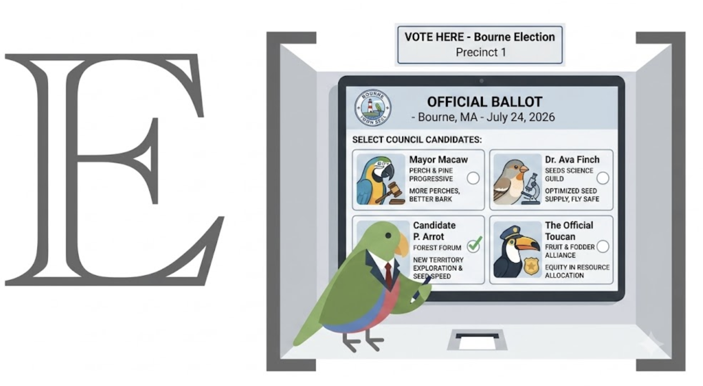

# voting — election-method modeling and ballot analysis CLI



[View the project website](https://expectedparrot.github.io/voting/)

`voting` is a JSON-first command-line toolkit for building elections, recording
ballots, and comparing voting methods. It supports single- and multi-winner
elections across plurality, ranked, approval, score, grade, allocation, and
Condorcet families.

It can:

- Register candidates, proposals, voters, weights, and eligibility.
- Configure elections with a ballot type, counting method, number of seats,
  and tie policy.
- Record ballots directly or import them from another system.
- Validate ballots before counting.
- Run 28 method names and aliases, including FPTP, approval, score, STAR, IRV,
  STV, Borda, Schulze, ranked pairs, Copeland, Kemeny–Young, Bucklin, runoff,
  cumulative voting, and majority judgment.
- Save every count so results from different methods can be inspected and
  compared.
- Generate synthetic EDSL preference studies or publish Humanize surveys for
  real respondents.

## Use with a coding agent

Copy this into Codex or Claude Code:

```text
Install voting and help me run an election:

uv tool install --upgrade --force \
  "voting[humanize] @ git+https://github.com/expectedparrot/voting.git@main"

Run `voting agent-bootstrap` and follow its instructions and `next_steps`.
```

`agent-bootstrap` works before a project exists and at every later phase. It
returns the agent's operating rules, the current project state, the
getting-started guide, and executable next steps. Run it again after material
changes or when resuming work.

## Install

Python 3.11 or newer is required.

```bash
uv tool install \
  "voting @ git+https://github.com/expectedparrot/voting.git@main"
voting --help
```

To include EDSL support for synthetic and hosted surveys:

```bash
uv tool install --upgrade --force \
  --with-executables-from "edsl @ git+https://github.com/expectedparrot/edsl.git@main" \
  "voting[humanize] @ git+https://github.com/expectedparrot/voting.git@main"
```

Local ballot entry and counting do not require EDSL or authentication.

For development:

```bash
git clone https://github.com/expectedparrot/voting.git
cd voting
uv sync --extra dev --extra humanize
pytest -q
```

## How a voting project works

Each project stores its state under `.voting/`:

```text
.voting/
├── meta.json
├── options/       candidates or proposals
├── voters/        voters, weights, eligibility, and traits
├── elections/     method, ballot type, seats, and eligible options
├── ballots/       append-only ballot records
├── results/       saved count runs
└── output/        generated survey artifacts
```

The normal lifecycle is:

```text
init → setup options and voters → configure election → collect ballots
     → validate → count → inspect or compare results
```

`voting status` reports the inferred phase and recommended next commands.
Commands emit structured JSON by default; use the top-level `--human` flag for
terminal-friendly output.

## Complete example

This election records three ranked ballots, counts them with IRV, then reuses
the same ballots for a Borda comparison:

```bash
voting init neighborhood_vote --description "Choose one neighborhood project"
cd neighborhood_vote

voting option add library "Extend library hours" --type proposal
voting option add shelters "Build covered bus shelters" --type proposal
voting option add lighting "Upgrade park lighting" --type proposal

voting voter add voter_1 "Voter 1"
voting voter add voter_2 "Voter 2"
voting voter add voter_3 "Voter 3"

voting election add projects "Neighborhood projects" \
  --method irv --ballot-type ranked
voting election add-option projects library
voting election add-option projects shelters
voting election add-option projects lighting
voting election open projects

voting ballot rank projects voter_1 library shelters lighting
voting ballot rank projects voter_2 shelters lighting library
voting ballot rank projects voter_3 lighting library shelters

voting ballot validate projects
voting count run projects
voting count run projects --method borda
voting count list
```

## Ballot formats

| Ballot type | What the voter supplies | Example methods |
|---|---|---|
| `single_choice` | One option | FPTP, majority, runoff, SNTV |
| `ranked` | Options in preference order | IRV, STV, Borda, Condorcet, Bucklin |
| `approval` | Any number of approved options | Approval, block, limited voting |
| `score` | Numeric scores by option | Score, STAR |
| `grade` | Ordered labels such as good or fair | Majority judgment |
| `allocated` | A point budget distributed across options | Cumulative voting |

Ballot type determines what preference information is available. A
single-choice ballot cannot recover second preferences, and an approval ballot
does not rank the approved options.

## Three ways to collect preferences

### Record ballots directly

```bash
voting ballot cast election_id voter_id --choice option_id
voting ballot rank election_id voter_id first second third
voting ballot approve election_id voter_id --option first --option second
voting ballot score election_id voter_id first=5 second=3 third=0
voting ballot grade election_id voter_id first=excellent second=good
voting ballot allocate election_id voter_id first=7 second=3
```

### Generate synthetic preferences

Voter traits can describe the personas used by an EDSL study:

```bash
voting voter set-trait voter_1 persona \
  '"Daily bus rider who uses the library on weekends"'
voting survey generate projects
voting --human survey show projects
```

The generated Python script is saved under `.voting/output/` for inspection
before it is run and imported.

### Publish a survey for people

```bash
voting survey humanize projects
voting survey publish projects
voting survey responses projects
```

Publishing returns respondent and admin URLs. Email invitations are also
supported through `voting survey email`; see `voting docs show humanize`.
Authentication is handled by the `ep` CLI and is only needed for these EDSL
workflows.

## Output

Every command returns one JSON envelope:

```json
{
  "command": "status",
  "status": "ok",
  "data": {},
  "warnings": [],
  "errors": [],
  "next_steps": []
}
```

Count results include winners, ranking, ballot totals, method-specific
diagnostics, warnings, and the settings used for that run. Results are saved
under `.voting/results/`, making method comparisons reproducible.

## Command reference

| Command | Purpose |
|---|---|
| `voting agent-bootstrap` | Give a coding agent its guide, project phase, and next actions. |
| `voting init` / `info` / `status` | Create, summarize, and resume a project. |
| `voting option ...` | Manage candidates, proposals, and eligibility. |
| `voting voter ...` | Manage voters, weights, traits, and eligibility. |
| `voting election ...` | Configure elections, methods, seats, options, and tie policy. |
| `voting ballot ...` | Record, import, list, show, and validate ballots. |
| `voting count run/list/show` | Run and inspect saved counts. |
| `voting survey generate/show` | Build and inspect synthetic preference studies. |
| `voting survey humanize/publish/email/responses` | Create and operate hosted human surveys. |
| `voting docs list/show/search` | Read built-in guides and voting-method documentation. |

Run `voting <command> --help` for complete arguments or
`voting docs show voting-methods` for method-selection guidance.

## Scope

`voting` is an analysis and survey tool. It is not an election-administration,
identity-verification, security-audit, or legally certified voting system.
